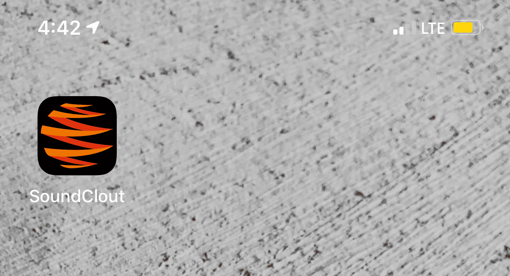
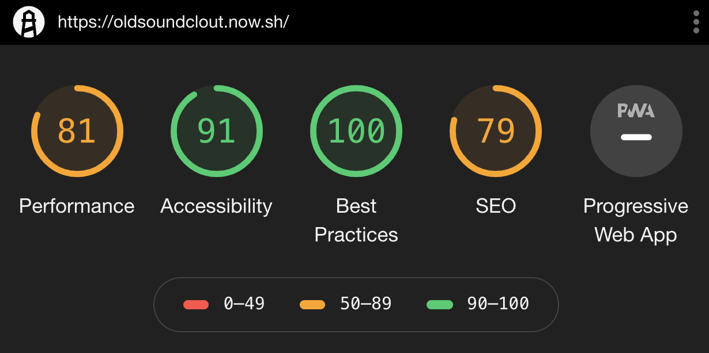
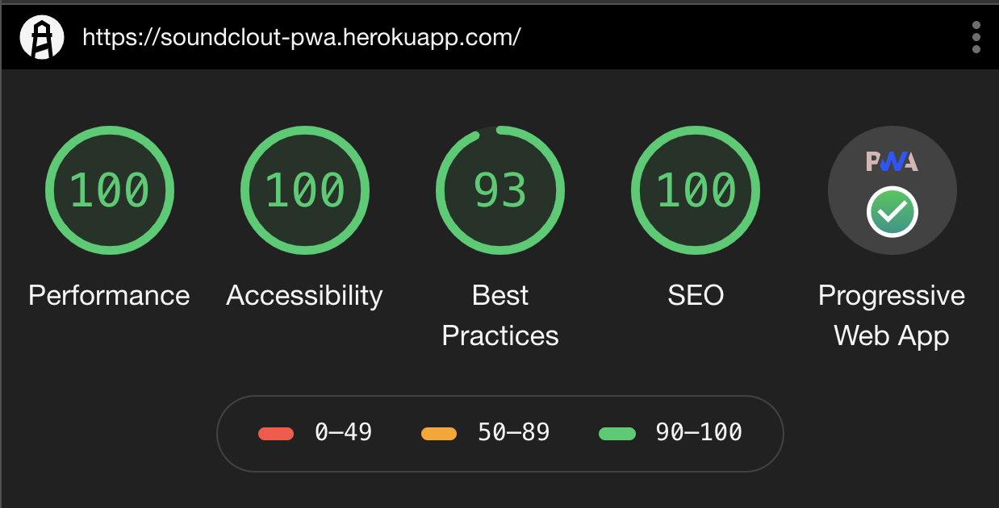

# Website | [Soundclout](https://soundclout-pwa.herokuapp.com/)

## Getting Started

1. Use `npm install` to install all dependencies as from the package.json.

4. Use `npm start` to start the application and seed the database.

## Getting Started (Mobile)
1. Open the [link](https://soundclout-pwa.herokuapp.com/) on your mobile device.

2. On Safari, hit the download button on the bottom.

3. Scroll to the right until you see `Add to Home Screen` and tap on it.

4. Soundclout should now be available on your phone.

## Preview of Application

### App Icon 

### App Home Screen

## Audits

### Before

### After

### Built using

* [React](https://reactjs.org/docs/getting-started.html) - JavaScript library for building user interfaces
* [Express](https://expressjs.com/) - Server framework for Node.js
* [MongoDB](https://docs.mongodb.com/) - Cross-platform document-oriented database program

## Tests
Use `npm test` from the root directory.

## Author
* [Thomas McKyer](https://github.com/Tivler)

## License

This project is licensed under the MIT License - see the [LICENSE.md](LICENSE.md) file for details
